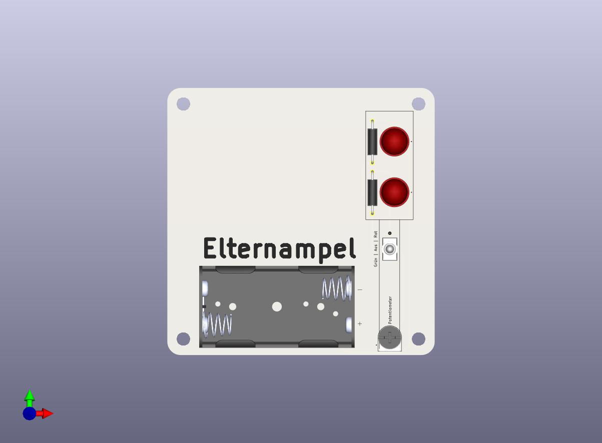

# Door Sign Design
---
## Preview


## Folder Structure
```bash
├── README.md
├── door-sign
│   ├── bom
│   │   └── ibom.html
│   ├── door-sign.kicad_pcb
│   ├── door-sign.kicad_prl
│   ├── door-sign.kicad_pro
│   ├── door-sign.kicad_sch
│   ├── fp-lib-table
│   ├── schematic.pdf
│   └── sym-lib-table
├── images
│   └── preview.jpg
└── libs
```

## Todo
- [x] schematic
- [x] pcb
- [x] check
- [x] bom
- [ ] order
    - [ ] pcb
    - [ ] components
- [ ] test